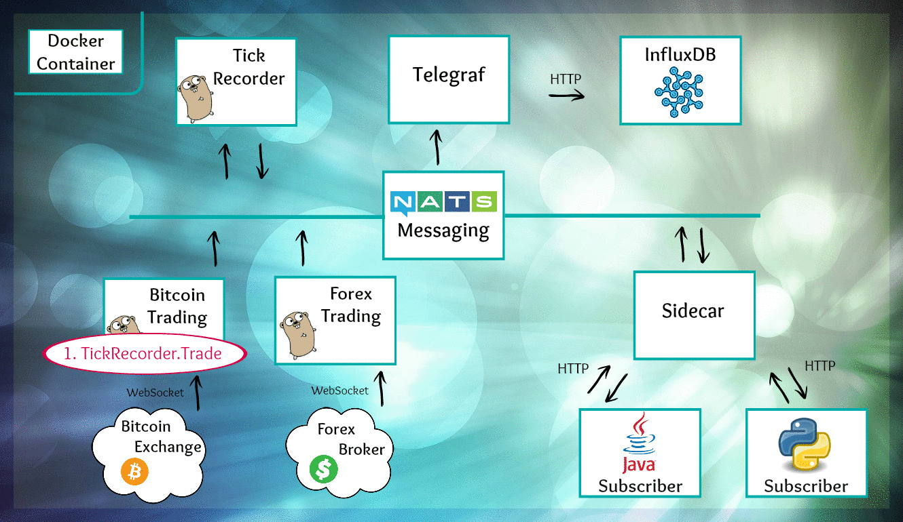

<meta property="og:title" content="Microservices with Go Micro" />
<meta property="og:image" content="images/micro.jpg" />

# Microservices with Go Micro

[Micro](https://github.com/micro/micro) is a set of utilities and libraries that makes it easier to write and manage microservices.
It was written and maintained by [Asim Aslam](https://twitter.com/chuhnk), a developer from London who is getting help from an enthusiastic community.

A microservice written for micro can be written in any language but it's easier to write it in Go (until ports of Micro will be available in other languages). For non-Go microservices, there exists the sidecar (an HTTP proxy into the microservice) to handle this situation.  Microservices often typically communicate with JSON but micro uses protobuf encoding by default. Protobufs offer solid serialization capabilities, static types, and can be used to also declare the API of a specific microservice.  By default the messages are sent over HTTP but a message broker (RabbitMQ, Kafka, NSQ, etc) can allow improvements on top of this such as persistence, scalability or reliability. In this case we use [NATS](https://nats.io) since it's very simple, fast and lean. It also has enough functionality to act as transport, broker and registry (the latter due to its broadcast queries). More information can be found at [Asim's blogpost](https://blog.micro.mu/2016/04/11/micro-on-nats.html).

[John Nguyen](https://github.com/nii236), an Australian developer, uses Micro to collect and visualize financial instruments (Bitcoin and foreign exchange). I asked him to demo his setup and we recorded it in a 30 minute video:

<iframe width="560" height="315" src="https://www.youtube.com/embed/b_Ivq2GYlI4" frameborder="0" allowfullscreen></iframe>

## Agenda

* [0:00](http://www.youtube.com/watch?v=b_Ivq2GYlI4) Overview of Micro and NATS
* [8:00](http://www.youtube.com/watch?v=b_Ivq2GYlI4&t=8m00s) Demo
* [16:17](http://www.youtube.com/watch?v=b_Ivq2GYlI4&t=16m17s) Publishing a message to NATS
* [23:50](http://www.youtube.com/watch?v=b_Ivq2GYlI4&t=23m50s) Code of a publisher and a subscriber
* [27:44](http://www.youtube.com/watch?v=b_Ivq2GYlI4&t=27m44s) protobuf
* [29:03](http://www.youtube.com/watch?v=b_Ivq2GYlI4&t=29m03s) Python subscriber
* [31:31](http://www.youtube.com/watch?v=b_Ivq2GYlI4&t=31m31s) Persistance with project STAN

 

## Links

* [Micro](https://github.com/micro/micro) - tools for **managing** microservices
* [Go Micro](https://github.com/micro/go-micro) - libraries for **writing** microservices
* [Git repo of this demo](https://github.com/nii236/nii-finance)
* [Recorded presentation](https://skillsmatter.com/skillscasts/8340-london-go-usergroup#video) by Asim at the Go London User Group
* [Go kit](http://gokit.io/) - an alternative framework for managing microservices
